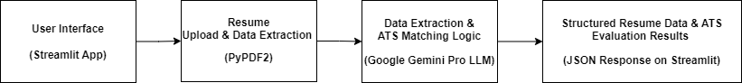

# LLM Powered Resume Data Extraction and Smart ATS System

### Overview
This project automates resume parsing and evaluation, leveraging the Google Gemini Pro LLM model. The system efficiently extracts structured data from resumes, matches them with job descriptions, and provides insights, improving the recruitment process for HR teams.

### Problem Statement
The recruitment process is time-consuming and error-prone due to manual resume evaluations. This tool automates the extraction of relevant information from resumes and compares it with job descriptions, improving efficiency and accuracy.

### Business Solution:
The Smart ATS and Resume Data Extraction tool automates the extraction of relevant information from resumes and evaluates them against job descriptions. Utilizing the Gemini Pro LLM model which works based on advanced Transformer-based NLP architecture, which enables it to process and generate human-like text. The system enhances the efficiency of the hiring process by providing structured data extraction and matching capabilities, allowing recruiters to make informed decisions faster.


### Key Features
1. Resume Data Extraction: Upload resumes in PDF format and extract structured information like personal details, professional summaries, work experience, and skills.
2. ATS Evaluation: Match resumes with job descriptions and generate a matching score, identify missing keywords, and provide resume improvement suggestions.

### Technology Used:
1. Google Gemini Pro LLM for natural language processing and data extraction.
2. Streamlit for the user interface.
3. PyPDF2 for extracting text from PDFs.
4. Python for overall application development.

### High Level Diagram


### Approach:
1.	Resume Upload: Users upload PDF resumes through the Streamlit interface.
2.	Text Extraction: The application extracts text from the uploaded PDF resumes using PyPDF2.
3.	Data Extraction: The extracted text is fed into the Gemini Pro LLM, which processes the content and returns structured data in JSON format.
4.	ATS Evaluation: Users can paste job descriptions to evaluate the uploaded resumes against the specified criteria, providing insights into the alignment between candidate profiles and job requirements.

### Installation
Make sure you enter the Google API key in the .env file.

1. Clone the repository:

``` git clone <repository-url> ```

``` cd -LLM-Powered-Resume-Data-Extraction-and-Smart-ATS-System ```

2. Install dependencies:

``` pip install -r requirements.txt ```

3. Run the application:
   
``` streamlit run app.py ```

### Contributing
Feel free to submit pull requests for bug fixes or enhancements. Please ensure your contributions align with the project goals.
